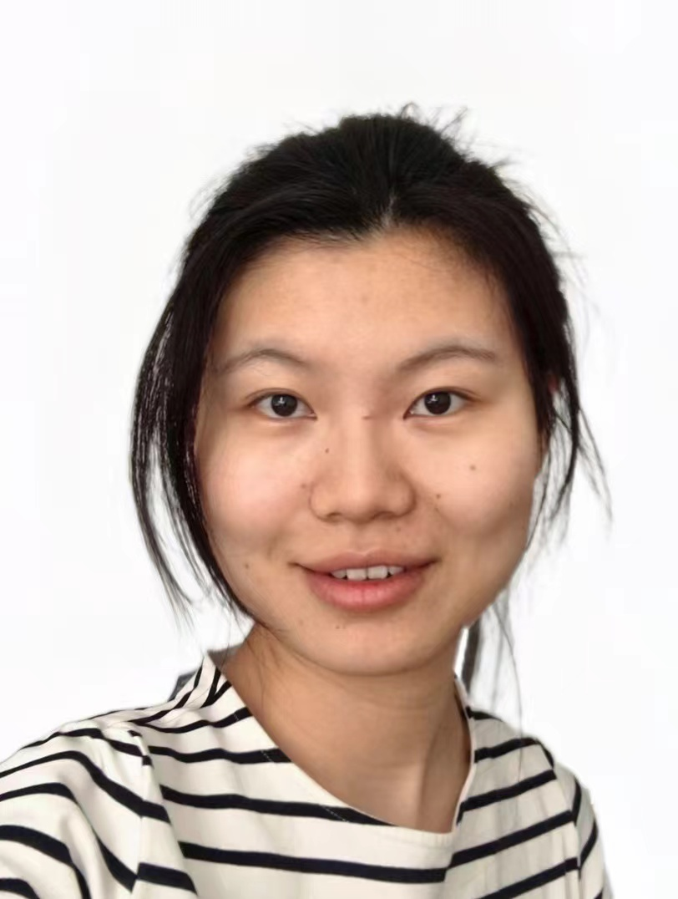

**Xing Hu (胡杏)**

Email: huxing@ict.ac.cn 

## Education

**Ph.D.**    State Key Lab of Computer Architecture. Institute of Computing Technology (ICT), University of Chinese Academy of Sciences (UCAS)      2009.09 - 2014.07 

**B.S.**      Computing Science and technology Department. HuaZhong University of Science & Technology (HUST)      2005.09 - 2009. 07 

## Professional Experience

**Professor** Chinese Academy of Sciences, Institute of Computing Technology (ICT)  2023.09 –– Present 

**Associate Professor** Chinese Academy of Sciences, Institute of Computing Technology (ICT)  2020.04 –– 2023.09

**Postdoc**                Department of Electrical and Computer Engineering, University of California, Santa Barbara        2017.01 –– 2020.03

**Research Scientist**     Shannon Cognitive Lab, HUAWEI Technologies    2014. 07 –– 2016.12

## Research
Over the past half-century, computing systems have undergone a steady and progressive evolution, establishing themselves as the fundamental infrastructure supporting humanity in problem-solving. Nowadays, propelled by advancements in Artificial Intelligence (AI) techniques, the essence of computing has been broadened. Thus, our ultimate goal is to establish intelligent automated machines to achieve better computational efficiency, more powerful computational capabilities, and more natural interaction. Our research interests include:

* **Efficient and Safe Intelligent Computing Architectures**
We explore efficient and safe architectures for intelligent computing, such as visual understanding, visual modeling, reasoning, and planning, aiming to build the physical foundation of intelligent agents to perceive, understand, and solve complex problems.
  
* **Interactive Intelligent Computing System Design**
We delve into the integration of AI capabilities to tackle critical and intricate challenges, particularly those involved in constructing computing systems. Designing computing systems poses unique challenges compared to traditional AI tasks, given the exceptional precision requirements (>99.99999999999%). These requirements far exceed the levels typically associated with prediction and generation tasks in the AI domain. Our objective is to explore system design methodologies that harness the outstanding prediction/exploration capabilities of AI techniques while ensuring the functionality and correctness of the system.

* **Instruction-following Human-machine Interaction**
We explore the new human-machine interaction manner that eliminates effortless programming. We explore the AI agent based on program synthesis and reinforcement learning to empower the human productivity, including the natural language programming frameworks and instruction-following embodied agents.

## Publications
* Jianan Mu, Husheng Han, Shangyi Shi, Jing Ye, Zizhen Liu,Shengwen Liang, Meng Li, Mingzhe Zhang, Song Bian, Xing Hu#, Huawei Li, Xiaowei Li, Alchemist: A Unified Accelerator Architecture for Cross-Scheme Fully Homomorphic Encryption, in Design Automation Conference (DAC) 2024.
* Husheng Han, Xing Hu#, Yifan Hao, Kaidi Xu, Pucheng Dang, Ying Wang, Yongwei Zhao, Zidong Du, Qi Guo, Yanzhi Wang, Xishan Zhang, Tianshi Chen, Real-Time Robust Video Object Detection System Against Physical-World Adversarial Attacks, TCAD2024.
* Weihao Kong, Yifan Hao, Yongwei Zhao, Xinkai Song, Xiaqing Li, Mo Zou, Rui Zhang, Chang Liu, Yuanbo Wen, Pengwei Jin, Xing Hu, Wei Li, Zidong Du, Qi Guo, Zhiwei Xu, Tianshi Chen, DiffBoost: Full-Network Differential Acceleration for Diffusion Models, ISCA2024.
* Shuyao Cheng, Pengwei Jin, Qi Guo, Zidong Du, Rui Zhang, Xing Hu, Yongwei Zhao, Yifan Hao, Guan Xiangtao, Husheng Han, Zhengyue Zhao, Ximing Liu, Xishan Zhang, yuejie Chu, Mao Long, Tianshi Chen, Yunji Chen. Automated CPU Design by Learning from Input-Output Examples, IJCAI2024.
* Shuyao Cheng, Chongxiao Li, Zidong Du, Rui Zhang, Xing Hu, Xiaqing Li, Guanglin Xu, Yuanbo Wen, Qi Guo, Revisiting Automatic Pipelining: Gate-level Forwarding and Speculation, DAC2024.
* Zhengyue Zhao, Jinhao Duan, Kaidi Xu, Chenan Wang, Rui Zhang, Zidong Du, Qi Guo, Xing Hu#, Can Protective Perturbation Safeguard Personal Data from Being Exploited by Stable Diffusion? CVPR, 2024
* Xinkai Song, Yuanbo Wen, Xing Hu#, Tianbo Liu, Haoxuan Zhou, Husheng Han, Tian Zhi, Zidong Du, Wei Li, Rui Zhang, Chen Zhang, Lin Gao, Qi Guo, Tianshi Chen, Cambricon-R: A Fully Fused Accelerator for Real-Time Learning of Neural Scene Representation, MICRO 2023.
* Shaohui Peng, **Xing Hu**, Qi Yi, Rui Zhang, Jiaming Guo, Di Huang, Zikang Tian, Ruizhi Chen, Zidong Du, Qi Guo, Yunji Chen, Ling Li, Hypothesis, Verification, and Induction: Grounding Large Language Models with Self-Driven Skill Learning, AAAI 2023.
* Zikang Tian, Ruizhi Chen, **Xing Hu**, Ling Li, Rui Zhang, Fan Wu, Shaohui Peng, Jiaming Guo, Zidong Du, Qi Guo, Yunji Chen, Decompose a Task into Generalizable Subtasks in Multi-Agent Reinforcement Learning, in Advances in Neural Information Processing Systems (NeurIPS), 2023.
* Yunkai Gao, Rui Zhang, Jiaming Guo, Fan Wu, Qi Yi, Shaohui Peng, Siming Lan, Ruizhi Chen, Zidong Du, Xing Hu, Qi Guo, Ling Li, Yunji Chen, Context shift reduction for offline meta-reinforcement learning, in Advances in Neural Information Processing Systems (NeurIPS), 2023.
* Siming Lan, Rui Zhang, Qi Yi, Jiaming Guo, Shaohui Peng, Yunkai Gao, Fan Wu, Ruizhi Chen, Zidong Du, Xing Hu, Ling Li, Yunji Chen, Contrastive Modules with Temporal Attention for Multi-Task Reinforcement Learning, in Advances in Neural Information Processing Systems (NeurIPS), 2023.
* Di Huang, Ziyuan Nan, **Xing Hu**, Pengwei Jin, Shaohui Peng, Yuanbo Wen, Rui Zhang, Zidong Du, Qi Guo, Yewen Pu, Yunji Chen, ANPL: Compiling Natural Programs with Interactive Decomposition, in Advances in Neural Information Processing Systems (NeurIPS), 2023.
* Jiaming Guo, Rui Zhang, Shaohui Peng, Qi Yi, **Xing Hu**, Ruizhi Chen, Zidong Du, Ling Li, Qi Guo, Yunji Chen, Efficient Symbolic Policy Learning with Differentiable Symbolic Expression, in Advances in Neural Information Processing Systems (NeurIPS), 2023.
* Qi Yi, Rui Zhang, Shaohui Peng, Jiaming Guo, Yunkai Gao, Kaizhao Yuan, Ruizhi Chen, Siming Lan, **Xing Hu**, Zidong Du, Xishan Zhang, Qi Guo, Yunji Chen, Online prototype alignment for few-shot policy transfer, in International Conference on Machine Learning (ICML), 2023.
* Pengwei Jin, Di Huang, Rui Zhang, **Xing Hu**, Ziyuan Nan, Zidong Du, Qi Guo, Yunji Chen, Online symbolic regression with informative query. AAAI 2022
* Shaohui Peng, **Xing Hu**, Rui Zhang, Jiaming Guo, Qi Yi, Ruizhi Chen, Zidong Du, Ling Li, Qi Guo, Yunji Chen, Conceptual reinforcement learning for language-conditioned tasks, in AAAI, 2023.
* Jun Bi, Qi Guo, Xiaqing Li, Yongwei Zhao, Yuanbo Wen, Yuxuan Guo, Enshuai Zhou, **Xing Hu**, Zidong Du, Ling Li, Huaping Chen, Tianshi Chen, Heron: Automatically constrained high-performance library generation for deep learning accelerators, in ASPLOS 2022.
* Qi Yi, Rui Zhang, Shaohui Peng, Jiaming Guo, **Xing Hu**, Zidong Du, Qi Guo, Yunji Chen, Object-category aware reinforcement learning, in Advances in Neural Information Processing Systems (NeurIPS), 2023.
* Shaohui Peng, **Xing Hu**, Rui Zhang, Ke Tang, Jiaming Guo, Qi Yi, Ruizhi Chen, Zidong Du, Ling Li, Qi Guo, Yunji Chen, Causality-driven hierarchical structure discovery for reinforcement learning, in Advances in Neural Information Processing Systems (NeurIPS), 2023.
* Yifan Hao, Yongwei Zhao, Chenxiao Liu, Zidong Du, Shuyao Cheng, Xiaqing Li, **Xing Hu**, Qi Guo; Zhiwei Xu; Tianshi Chen, Cambricon-P: A bitflow architecture for arbitrary precision computing, in International Symposium on Microarchitecture (MICRO), 2022. 
* Yuanbo Wen, Qi Guo, Qiang Fu, Xiaqing Li, Jianxing Xu, Yanlin Tang, Yongwei Zhao, **Xing Hu**, Zidong Du, Ling Li, Chao Wang, Xuehai Zhou, Yunji Chen, Babeltower: Learning to auto-parallelized program translation, in International Conference on Machine Learning (ICML), 2022. 
* Ling Liang, Kaidi Xu, **Xing Hu**, Lei Deng, Yuan Xie, Toward robust spiking neural network against adversarial perturbation, in Advances in Neural Information Processing Systems (NeurIPS), 2022.
* **Xing Hu**, Ling Liang, Xiaobing Chen, Lei Deng, Yu Ji, Yufei Ding, Zidong Du, Qi Guo, Tim Sherwood, Yuan Xie, A Systematic View of Model Leakage Risks in Deep Neural Network Systems, in IEEE Transactions on Computers (TC), 2023. 
* Husheng Han, Kaidi Xu, **Xing Hu#**, Xiaobing Chen, Ling Liang, Zidong Du, Qi Guo, Yanzhi Wang, Yunji Chen, ScaleCert: Scalable Certified Defense against Adversarial Patches with Sparse Superficial Layers, in Advances in Neural Information Processing Systems (NeurIPS), 2021. 
* Xinkai Song, Tian Zhi, Zhe Fan, Zhenxing Zhang, Xi Zeng, Wei Li, **Xing Hu**, Zidong Du, Qi Guo, Yunji Chen, Cambricon-G: A Polyvalent Energy-Efficient Accelerator for Dynamic Graph Neural Networks, IEEE Transactions on Computer-Aided Design of Integrated Circuits and Systems (TCAD), 2021. (CCF-A)
* Yongwei Zhao, Chang Liu, Zidong Du, Qi Guo, **Xing Hu**, Yimin Zhuang, Zhenxing Zhang, Xinkai Song, Wei Li, Xishan Zhang, Ling Li, Zhiwei Xu, Tianshi Chen, Cambricon-Q: a hybrid architecture for efficient training, in International Symposium on Computer Architecture (ISCA), 2021.
* Xinfeng Xie, Zheng Liang, Peng Gu, Abanti Basak, Lei Deng, Ling Liang, **Xing Hu**, Yuan Xie, Spacea: Sparse matrix vector multiplication on processing-in-memory accelerator, in IEEE International Symposium on High-Performance Computer Architecture (HPCA), 2021. 
* Yuanbo Wen, Qi Guo, Zidong Du, Jianxing Xu, Zhenxing Zhang, **Xing Hu**, Wei Li, Rui Zhang, Chao Wang, Zhou Xuehai, Tianshi Chen, Enabling One-size-fits-all Compilation Optimization across Machine Learning Computers for Inference, in IEEE Transactions on Computers (TC), 2021. 
* Xiaobing Chen, Yuke Wang, Xinfeng Xie, **Xing Hu#**, Abanti Basak, Ling Liang, Mingyu Yan, Lei Deng, Yufei Ding, Zidong Du, Yuan Xie, Rubik: A hierarchical architecture for efficient graph neural network training, in IEEE Transactions on Computer-Aided Design of Integrated Circuits and Systems (TCAD), 2021.
* **Xing Hu**, Ling Liang, Lei Deng, Shuangchen Li, Pengfei Zuo, Xinfeng Xie, Yu Ji, Yufei Ding, Timothy Sherwood, Yuan Xie, DeepSniffer, an Neural Network Model Extraction Framework by Learning Architecture Hints, in ACM International Conference on Architectural Support for Programming Languages and Operating Systems (ASPLOS), 2020. 
* Mingyu Yan, Lei Deng, **Xing Hu**, Ling Liang, Yujing Feng, Xiaochun Ye, Zhiming Zhang, Dongrui Fan, Yuan Xie, HyGCN: A GCN Accelerator with Hybrid Architecture, in High Performance Computer Architecture (HPCA), 2020.
* Jilan Lin, Cheng-Da Wen, **Xing Hu**, Tianqi Tang, Chao Lin, Yu Wang, Yuan Xie, Rescuing RRAM-Based Computing From Static and Dynamic Faults, in IEEE Transactions on Computer-Aided Design of Integrated Circuits and Systems (TCAD), 2020.
* **Xing Hu**, Yang Zhao, Lei Deng, Ling Liang, Pengfei Zuo, Yingyan Lin, Yuan Xie, Hardware Trojaning in Neural Network Accelerator, to appear in IEEE Transactions on Computer-Aided Design of Integrated Circuits and Systems (TCAD), 2020. 
* Minyu Yan, **Xing Hu**, Shuangchen Li, Abanti Basak, Han Li, Xin Ma, Itir Akgun, Yujing Feng, Peng Gu, Lei Deng, Xiaochun Ye, Zhimin Zhang, Dongrui Fan, Yuan Xie, Alleviating Irregularity in Graph Analytics Acceleration: a Hardware/Software Co-Design Approach, in IEEE/ACM International Symposium on Microarchitecture (MICRO), 2019.
* Lei Deng, Yujie Wu, **Xing Hu**, Ling Liang, Yufei Ding, Guoqi Li, Guangshe Zhao, Peng Li, Yuan Xie. Rethinking the Performance Comparison between SNNs and ANNs, in Neural Networks 2019.
* **Xing Hu**, Matheus Ogleari, Jishen Zhao, Shuangchen Li, Abanti Basak, Yuan Xie, Persistence parallelism optimization: a holistic approach from memory bus to RDMA network, in IEEE/ACM International Symposium on Microarchitecture (MICRO), pp 494-506, 2018.
* **Xing Hu**, Dylan Stow, Yuan Xie, Die stack is happening, in IEEE Micro, pp. 22-28, 2018.
* Wenqing Huangfu, Shuangchen Li, **Xing Hu**, Yuan Xie, RADAR: a 3D-reRAM based DNA alignment accelerator architecture, in Design Automation Conference (DAC), pp. 59-64, 2018. 
* Yang Zhao, **Xing Hu**, Shuangchen Li, Jing Ye, Lei Deng, Yu Ji, Jianyu Xu, Dong Wu, and Yuan Xie. Memory Trojan Attacks on Neural Network Accelerators, in Design Automation and Test in Europe (DATE), pp. 1402-1407, 2019.
* Xinfeng Xie, **Xing Hu**, Peng Gu, Shuangchen Li, Yu Ji, Yuan Xie, NNBench-X: Benchmarking and Understanding Neural Network Workloads for Accelerator Designs, to appear in Computer Architecture Letter (CAL), pp. 38-42, 2019. 
* Mingyu Yan, **Xing Hu**, Shuangchen Li, Itir Akgun, Han Li, Xin Ma, Lei Deng, Xiaochun Ye, Zhimin Zhang, Dongrui Fan, and Yuan Xie, Balancing Memory Accesses for Energy-Efficient Graph Analytics Accelerators, to appear in ACM/IEEE International Symposium on Low Power Electronics and Design (ISLPED), 2019.
* Shuangchen Li, Alvin Oliver Glova, **Xing Hu**, Peng Gu, Dimin Niu, Krishna T. Malladi, Hongzhong Zheng, Yuan Xie, SCOPE: a stochastic computing engine for DRAM-based in-situ accelerator, in IEEE/ACM International Symposium on Microarchitecture (MICRO), pp. 696-709, 2018. 
* Wenqin Huangfu, Xueqi Li, Shuangchen Li, **Xing Hu**, Peng Gu, Yuan Xie, MEDAL: Scalable DIMM based Near Data Processing Accelerator for DNA Seeding Algorithm, accepted in IEEE/ACM International Symposium on Microarchitecture, 2019. 
* Abanti Basak, **Xing Hu**, Shuangchen Li, Sang Min Oh, Yuan Xie, exploring core and cache hierarchy bottlenecks in graph processing workloads, in Computer Architecture Letter (CAL), pp. 197-200, 2018. 
* Abanti Basak, Shuangchen Li, **Xing Hu**, Sang Min Oh, Yuan Xie, Analysis and Optimization of the Memory Hierarchy for Graph Processing Workloads, in High Performance Computer Architecture (HPCA), pp 373-386, 2019. 
* Liu Liu, Lei Deng, Xing Hu, Maohua Zhu, Guoqi Li, Yufei Ding, Yuan Xie, Dynamic Sparse Graph for Efficient Deep Learning, in International Conference on Learning Representations (ICLR), 2019.  
* Lin Ning, Hang Lu, **Xing Hu**, Xiaowei Li, When Deep Learning Meets the Edge: AutoMasking Deep Neural Networks for Efficient Machine Learning on Edge Devices, to appear in IEEE International Conference on Computer Design (ICCD), 2019.
* Yu Ji, Youyang Zhang, Xinfeng Xie, Shuangchen Li, Peiqi Wang, **Xing Hu**, Youhui Zhang, Yuan Xie, FPSA: A Full System Stack Solution for Reconfigurable ReRAM-based NN Accelerator Architecture, in 24th ACM International Conference on Architectural Support for Programming Languages and Operating Systems ASPLOS, pp 733-747, 2019.
* Jilan Lin, Shuangchen Li, **Xing Hu**, Lei Deng, Yuan Xie, CNNWire: Boosting Convolutional Neural Network with Winograd on ReRAM based Accelerators, in Great Lakes Symposium on VLSI (GLSVLSI), pp 283-286, 2019. 
* Kun Wu, Guohao Dai, **Xing Hu**, Shuangchen Li, Yu Wang, Yuan Xie, Memory-bounded Proof of Work Acceleration for Block-chain Applications. in Design Automation Conference (DAC), 2019. 
* Ling Liang, Lei Deng, Yueling Zeng, **Xing Hu**, Yu Ji, Xin Ma, Guoqi Li, Yuan Xie, Crossbar-aware neural network pruning, in IEEE Access 6:58324-58337, 2018. 
* Lei Deng, Ling Liang, G. Wang, Liang Chang, **Xing Hu**, Xin Ma, Liu Liu, Jing Pei, Guoqi Li, and Y. Xie, “SemiMap: A semi-folded convolution mapping for speed-overhead balance on crossbars,” in IEEE Transactions on Computer-Aided Design of Integrated Circuits and Systems (TCAD), 2018. 
* Lei Deng, Zhe Zou, Xin Ma, Ling Liang, Guanrui Wang, **Xing Hu**, Liu Liu, Jing Pei, Guoqi Li, Yuan Xie, Fast Object Tracking on a Many-core Neural Network Chip, in Frontiers in Neuroscience, section Neuromorphic Engineering, 2018. 
* Guoqing Chen, Yi Xu, **Xing Hu**, Xiangyang Guo, Jun Ma, Yu Hu, Yuan Xie, TSocket: Thermal-sustainable power budgeting, in ACM Transaction on Design Automation Electrical Systems, 21(2):29, 2016. 
* **Xing Hu**, Yi Xu, Jun Ma, Guoqing Chen, Yu Hu, and Yuan Xie, Tsocket: Thermal-sustainable power budgeting for dynamic threading, in Design Automation Conference (DAC), pp.181-187, 2014.
* **Xing Hu**, Guihai Yan, Yu Hu, and Xiaowei Li, Orchestrator: guarding against voltage emergencies in multi-threaded applications, in IEEE Transactions on VLSI systems, 22(12):2476-2487, 2014. 
* **Xing Hu**, Yi Xu, Yu Hu, and Yuan Xie, Swimming Lane: a composite design to mitigate voltage droop effects in 3D chips, in Asia and South Pacific Design Automation Conference (ASPDAC), pp. 550-555, 2014. 
* **Xing Hu**, Guihai Yan, Yu Hu, and Xiaowei Li, Orchestrator: a low-cost solution to reduce voltage emergencies for multi-threaded applications, in proceedings of Conference on Design, Automation and Test in Europe (DATE), pp. 208-213, 2013. 
* Songjun Pan, Yu Hu, **Xing Hu**, and Xiaowei Li, A cost-effective substantial-impact-filter based method to tolerate voltage emergencies, in proceedings of Conference on Design, Automation and Test in Europe (DATE), pp. 311-316, 2011.  

## Awards
* 2020 - Talent 
* 2016 - Huawei President Special Group Award
* 2014 - The Dean's Special Award of Chinese Academy of Sciences (TOP 1%) 
* 2013 - Director of Special Scholarship in ICT, CAS (TOP 1%); 

## Additional Professional Service
* ISCA23, ISCA24 ERC
* ICCAD20, ICCAD21, ICCAD22, ICCAD23 TPC
* MICRO20 TPC
* HPCA17 Submission Chair 
* DAC20 Session Co-chair
* ICCAD20 TPC

## Reviewer for Journals

TC, TCAD, TVLSI, TACO, etc.
